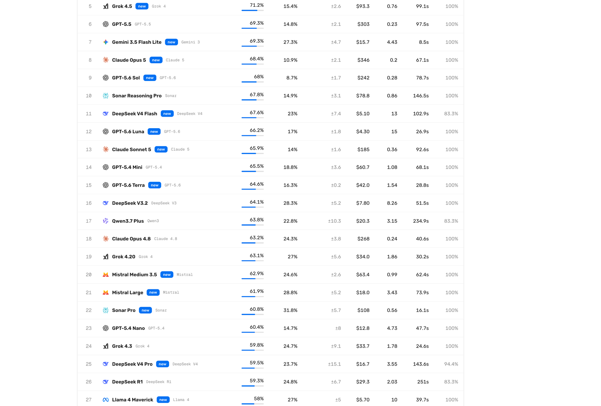
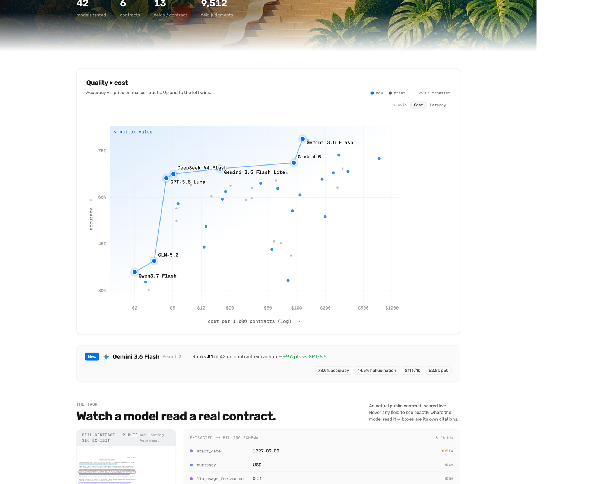
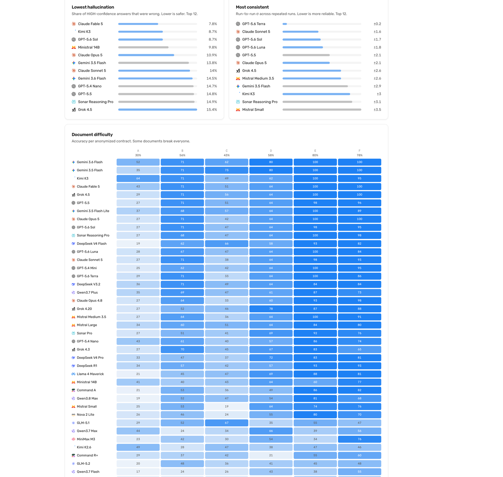
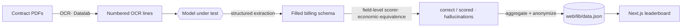
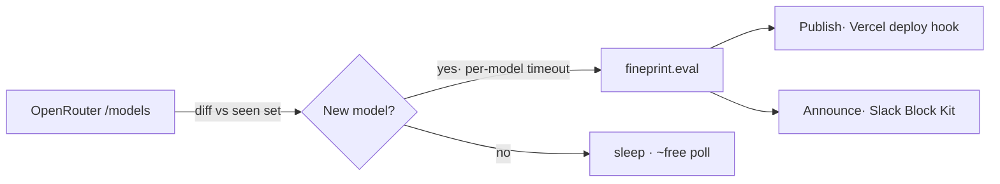

<div align="center">


<br><br>

# FinePrint

### Can it read the fine print?

**The document-extraction benchmark.** Every new LLM, scored on a task real businesses actually run:
turning messy, real-world contracts into correct, structured billing data.

<picture>
  <source media="(prefers-color-scheme: dark)" srcset="assets/flexprice-light.svg">
  
</picture>

<br><br>

[](LICENSE)


<sub>42 models · 14 labs · 9,512 field judgments · private, un-gameable holdout</sub>

</div>

---

## Why FinePrint

Most benchmarks test trivia. **FinePrint tests whether a model can take a real, messy contract and
return correct, structured billing data** — the task that actually breaks in production: fees,
cadences, currencies, entitlements, commitments, and the counterparty, each scored field-by-field.

- 🔒 **Un-gameable.** The contracts and ground-truth labels stay private. Only anonymized, per-model
  aggregates are ever published, so no model can train on the answers.
- ⚖️ **Economic-equivalence aware.** `$10k/quarter` scores correct against `$40k/year`. A model isn't
  punished for a valid different expression.
- 🎯 **Hallucination-aware.** We separately track how often a model was **confidently wrong** — the
  failure mode that matters most for billing.
- 🔁 **One command per model.** `python -m fineprint.eval <model>` runs it, scores it, and publishes
  it. An optional watch loop does it automatically the day a model ships.

<p align="center">
  
  
  
  
  
  
  
  
  
  
  
  
  
  
</p>

---

## The leaderboard

<div align="center"></div>

A snapshot of the top of the board (accuracy = fields read correctly; value = accuracy points per $/1k):

| # | Model | Accuracy | $ / 1k | Value | p50 |
|---|-------|----------|--------|-------|-----|
| 1 | Gemini 3.6 Flash | **78.9%** | $115.5 | 0.68 | 52.8s |
| 2 | Gemini 3.5 Flash | 78.6% | $132.1 | 0.60 | 49.9s |
| 3 | Kimi K3 | 73.7% | $278.2 | 0.26 | 180.6s |
| 4 | Claude Fable 5 | 72.5% | $732.4 | 0.10 | 70.2s |
| 5 | Grok 4.5 | 71.2% | $93.3 | 0.76 | 99.1s |
| 7 | Gemini 3.5 Flash Lite | 69.3% | **$15.7** | 4.43 | **8.5s** |
| 12 | GPT-5.6 Luna | 66.2% | **$4.30** | **15.3** | 26.9s |

The web app renders the full board plus ten analytics views — a quality×cost frontier, a
document-difficulty heatmap, latency tails, price spread, and more.

<div align="center">
  
  
</div>

---

## How it works



Each `(model × contract × N runs)` call is scored against the private ground truth. We keep the full
distribution (not just a mean) so we can report run-to-run **σ**, **p50/p90** latency, and
**reliability** alongside accuracy, hallucination rate, cost, and value.

---

## Quickstart

```bash
git clone https://github.com/ayushgupta4897/FinePrint.git
cd FinePrint
pip install -r requirements.txt
cp .env.example .env          # add OPENROUTER_API_KEY (every lab routes through one key)
```

**Score a model — one command** (runs → scores → aggregates → publishes to the site):

```bash
python -m fineprint.eval gpt-5.6-luna               # a curated model
python -m fineprint.eval anthropic/claude-opus-5    # ANY OpenRouter model, resolved live
python -m fineprint.eval qwen/qwen3.8-max --runs 3  # override runs/contract
python -m fineprint.eval moonshotai/kimi-k3 --dump  # + write the per-field audit trail
```

**Run the whole curated catalog, or the web app:**

```bash
python -m fineprint.run          # sweep every model in the catalog, then pricing + export
python -m pytest fineprint/tests # unit tests (scoring + aggregation)

cd fineprint/web && npm install && npm run dev   # the leaderboard at http://localhost:3000
```

> **Bring your own data.** The corpus and labels are private by design. Point the harness at your own
> OCR'd contracts and a ground-truth workbook via `FINEPRINT_OCR_DIR` and `FINEPRINT_GROUND_TRUTH`.
> See [`fineprint/README.md`](fineprint/README.md) for the harness details.

---

## What gets scored

The model fills a fixed billing schema and cites the exact OCR line(s) for every field. Roughly
**18 hard-scored fields per contract**: `start_date`, `platform_fee.*`, `hosting_fee.*`,
`llm_usage_fee.*`, `credit_grant.*`, `commitment.*`, `entitlement.*`, `override_*`, plus the customer
counterparty. Free-text fields are human-reviewed, not string-matched.

- **Normalized before compare** — numbers pulled from `"$0.05/min"`, dates canonicalized, missing ≡ $0.
- **Economic-equivalence** — annualized fee amounts match across cadences.
- **Hallucination** = share of **HIGH-confidence** answers that were wrong.
- **Accuracy** = Σcorrect / Σscored across all runs and contracts.

Per-client conventions layer on top of the base rules — see [`overrides/`](overrides/) for the
(generic, illustrative) example.

---

## Autonomous watch loop

FinePrint can score new models the day they ship — no human in the loop:



One portable entrypoint — `python -m fineprint.watch` — detects genuinely-new models, evaluates each
in a sandboxed child process with a wall-clock cap (a broken/slow endpoint gets skipped, never wedges
the loop), publishes the site, and posts a Slack card. Deploy it on Modal, GitHub Actions, or any
crontab. See [`fineprint/AUTOMATION.md`](fineprint/AUTOMATION.md).

---

## Project layout

```
FinePrint/
├── fineprint/            # the benchmark harness
│   ├── eval.py           #   one command: run + score + aggregate + publish a model
│   ├── run.py            #   the runner (model × contract × N runs)
│   ├── scoring.py        #   field-level scorer (economic-equivalence + hallucination)
│   ├── aggregate.py      #   pure run → per-model metrics (unit-tested)
│   ├── export.py         #   anonymized aggregates + difficulty matrix → web/lib/data.json
│   ├── pricing.py        #   OpenRouter price catalogue
│   ├── watch.py          #   autonomous new-model watch loop
│   ├── corpus/           #   public-contract collector (SEC EDGAR + CUAD)
│   ├── tests/            #   pytest
│   └── web/              #   Next.js leaderboard (quadrant, 10 analytics charts, OG cards)
├── pipeline/             # extraction schema + prompt + OCR + scorer internals
├── overrides/            # extraction rules (generic example)
└── modal_app.py          # deploy the watch loop on Modal
```

---

## Contributing

Issues and PRs welcome — new provider adapters, extra analytics views, and scoring improvements
especially. The scoring logic is unit-tested; please keep it green (`pytest fineprint/tests`).

## License

[MIT](LICENSE) © Flexprice.

<div align="center"><sub>Built by <b>Flexprice</b> — usage-based billing for AI companies.</sub></div>
